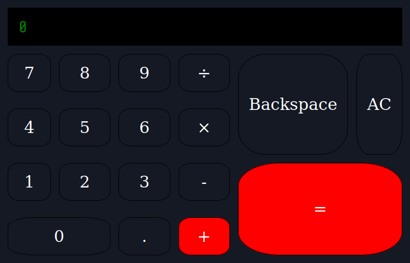

# Readme
# Calculator App (old version)

## Overview

The updated version of this project can be found [here](https://github.com/mattdimicelli/calculator2)

A basic calculator app. It evaluates a single pair of operands at at time, but 
allows the user to operate on the result of the previous equation.  

This was one of my original projects, done one month into my coding learning 
experience.

### Challenge

The design requirements from The Odin Project to build a Calculator app are detailed
[here](https://www.theodinproject.com/paths/foundations/courses/foundations/lessons/calculator)

### Screenshot

  

### Links

- [Live site](https://mattdimicelli.github.io/calculator/)
- [Repo](https://github.com/mattdimicelli/calculator)

## My process

### Built with

- It's all Vanilla... no frameworks, no pre-built components
- Eric Meyer's CSS Reset

### What I learned

This readme is being written eleven months after the coding, so I don't recollect 
everything perfectly.  It was an exercise in getting "everything together".  I recall
struggling with Flexbox but getting it to work... at least for the laptop screen
that I was using!  I didn't know anything about responsive design at the time 
that I wrote this.  
